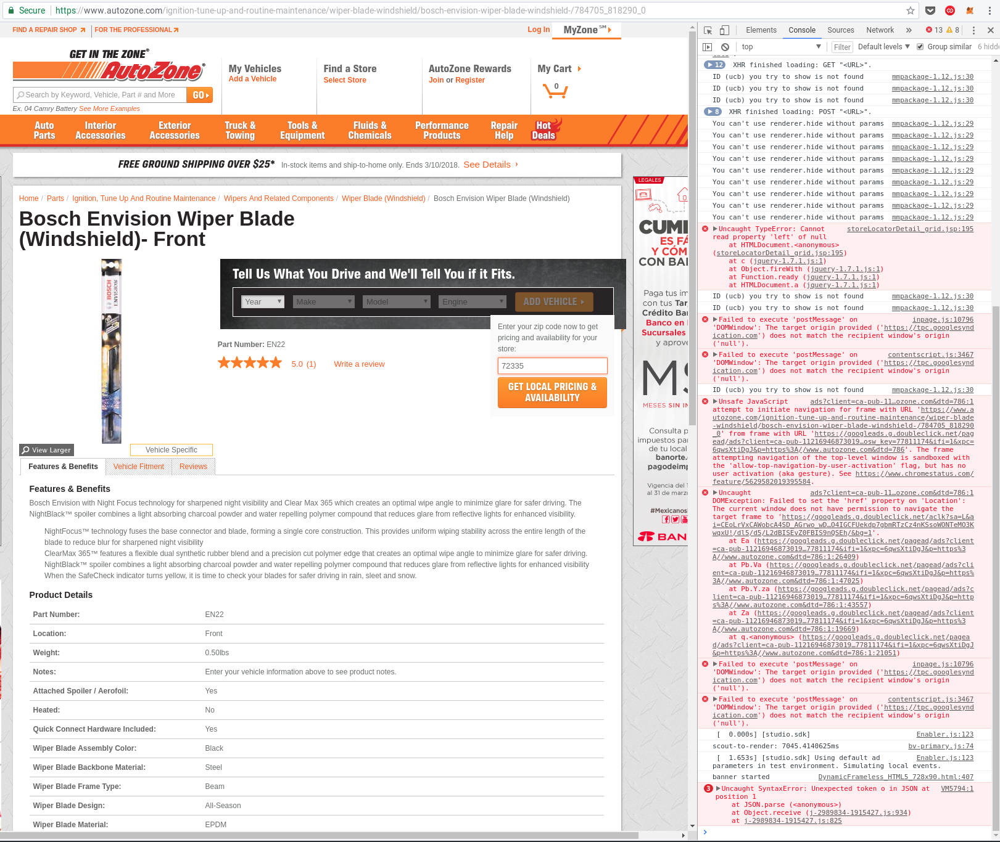

[Delta Lab](https://links.deltalab.ai/website) | [Twitter](https://links.deltalab.ai/twitter) | [LinkedIn](https://links.deltalab.ai/linkedin)

---

# Generalized Item Scraper

- Omar Trejo
- January, 2018

## Setup and Execute in Ubuntu 16 Environment

To execute the scraper in Ubuntu 16, you need to setup the development
environment by installing relevant Ubuntu 16 packages, as well as relevant
Python 3 packages. To do so, you may simply execute:

```
$ bash setup-environment.sh
```

### Settings

The `/settings.py` file (not to be confused with `utilities/settings.py`),
contains the settings that will be used for the scraping process. Currently, the
parameters that may be modified are:

- `save_html` (`True`/`False`): whether to save HTML files for crawled pages.
- `random_proxies` (`True`/`False`): use a random proxy for each request.
- `random_user_agents` (`True`/`False`): use a random User Agent for each
  request.
- `timezone` (valid timezone string): not used for now, but when scraping
  automatically, it will be used to select dates/times for scraping.
- `search_strings` (dictionary):
  - `file` (string): location of file that contains initial search strings.
  - `variable` (string): name of variable in the CSV that contains the strings
    used for searching.
  - `sample` (`None` or integer): If `None`, all the observations in the file
    will be used. If it's an integer, a random sample of size `sample` will be
    used.
- `required_fields` (list of strings): fields required for each sites.
- `sites` (dictionary): specification for the data to be scraped from each site
  with the following structure:
  - `site_name` (dictionary):
    - `base_url` (string): URL used to fix relative URLs within crawled pages.
    - `javascript` (boolean): if `True`, Selenium will be used instead of
      Scrapy's default headless browser/parser. Default is `False`.
    - `headless` (boolean): If `javascript` is `True`, then this option will be
      used. If it is `True` Selenium will run in headless mode, otherwise you
      will be need a windowing system to actually see the browser window.
      Default is `False`.
    - `cookies` (list of dictionaries): where each dictionary has `name` and
      `value` keys, one pair for each cookie. Default is no custom cookies.
    - `search` (dictionary): specification for search parameters for site.
      - `query` (string): URL used for searching (with `{}` where search strings
        should appear).
      - `auto_redirected` (list of strings, optional): if specified, a site's
        search pages will pass through a "auto-redirected detector" which uses
        the specified XPATH/CSS selectors to detect whether the return page is
        an "item page" insteado of a "search page", and if it is, it will be
        treated as such. The selectors I'm using for now look for price data for
        this detection mechanism.
      - `double_hop` (list of strings, optional): if specified, a site's search
        pages will pass through a "double hop detector" which uses the specified
        XPATH/CSS selectors to detect whether a page is a "intermediate" hop. If
        such detection is positive, the first category will be passed through to
        the standard "search page" parser, otherwise, it will be treated as a
        "search page" itself.
      - `first_item` (list of strings): XPATHs used to identify the first item
      - `fields` (dictionary): where each key is a string with the name of the
        variable as it will be store in the CSV (may end with `_css` to indicate
        that a CSS selector should be used instead of an XPATH selector), and
        the value should be a list with strings representing XPATH/CSS
        selectors.
    - `item` (dictionary, optional): specification for item parameters for site.
      - `fields` (dictionary): same as the `fields` dicitonary for `search`.

### Execute

Once the `settings.py` have been adjusted, execute:

```
$ python3 main.py
```

The results will be in the `outputs/` directory.

If we want to both save a log with the output as well as see the actual output
in real-time in the terminal, we can use the following instead (you may use the
`.txt` extension instead of `.log` if you prefer):

```
$ python3 -u main.py |& tee outputs/log.txt
```

If we want to execute under a schedule, we can use the native `cron` utility for
Ubuntu. First we need to edit `crontab` entries using the following command:

```
$ sudo crontab -e
```

Inside that file, we can use of the following specifications:

```
# Every minute
*/1 * * * * bash /home/ubuntu/flatfooted/cron_execute.sh

# Every hour (sharp)
0 * * * * bash /home/ubuntu/flatfooted/cron_execute.sh

# Every day (midnight)
0 0 * * * bash /home/ubuntu/flatfooted/cron_execute.sh

# Every week (Sunday midnight)
0 0 0 * * bash /home/ubuntu/flatfooted/cron_execute.sh
```

After saving the file, `cron` will start executing these jobs. You can also see
the list of current `cron` jobs with:

```
$ sudo crontab -l
```

The contents of the `cron_execute.sh` file are simple:

```
cd /home/ubuntu/flatfooted/
python3 main.py |& tee "log_$(date +\%Y-\%m-\%d).txt"
```

If you try to run the Python script directly, you will encounter lots of
problems (relative paths, environment packages, and so on), therefore I added an
extra level of indirection with the `cron_execute.sh` file.

## Database into single CSV script

The script used to extract data from the current database (MongoDB) and put it
into a single CSV is `scripts/db_to_csv.py`. It allows for three-dimensional
queries, and receives as inputs:

- `--date-start` (string): format: `YYYY-MM-DD-hh-mm`
- `--date-end` (string): format: `YYYY-MM-DD-hh-mm`
- `--site` (string): examples: `AMZN`, `ZORO`, etc
- `--sku` (string): string to search for in the `search_string` column
- `--file` (string): results file name

### Some notes about parameters

- If `date_start` is provided, then `date_end` must also be provided
- They can be combined to filter in multiple dimensions simultaneously
  - If combined, they will be combined using an `AND` mechanism
- In the case of `sku`, a "contains" mechanism is used (instead of a "equals"
  mecahanism) because the data is "dirty" and sometimes the SKU will be
  contained multiple times, or within a larger string. This was done to maximize
  the probability of getting the SKU required, even at the cost of not matching
  exactly.
- If `file` is not specified, `results.csv` will be used
- Currently there's no cross-referencing with searches (so the resulting CSV)
  does not have the information for the searches that preceded the item (if
  any).

### Examples

Assuming you're located in the `scripts/` directory.

- Example 1: download file [here](./docs/files/db_to_csv/example_1.csv)

```
python db_to_csv.py --date-start 2018-01-01-00-00 --date-end 2018-02-28-00-00 --file example_1.csv
```

- Example 2: download file [here](./docs/files/db_to_csv/example_2.csv)

```
python db_to_csv.py --date-start 2018-01-01-00-00 --date-end 2018-02-28-00-00 --search-string QUA41967 --file example_2.csv
```

- Example 3: download file [here](./docs/files/db_to_csv/example_3.csv)

```
python db_to_csv.py --search-string QUA41967 --file example_3.csv
```

- Example 4: download file [here](./docs/files/db_to_csv/example_4.csv)

```
python db_to_csv.py --site AMZN --file example_4.csv
```

- Example 5: download file [here](./docs/files/db_to_csv/example_5.csv)

```
python db_to_csv.py --site AMZN --search-string 65UX340C --file example_5.csv
```

## Tasks

### Phase 1

- [x] Join site and spreadsheet search strings
- [x] Test CSS selectors from `amzn` file
- [x] Removed 1,240 duplicates between site and spreaddsheet data
- [x] General search capability search-to-new-results-page
- [x] Test general search capability for Amazon
- [x] Use first-result mechanim to retrieve relevant item
- [x] Environment installlation scripts for Ubuntu 16

### Phase 2

- [x] Fix Twisted Reactor bug when scraping multiple sites
- [x] Test with two sites at the same time (use Staples)
- [x] Initial throttling mechanism
- [x] Initial randomized proxy mechanism
- [x] Initial randomize user-agent mechanism
- [x] Resarch best way to save results into database
  - Best done with `Item Pipelines`
- [x] Handle 429 (and possibly) other response codes
- [x] Include `search_string` to correlate results
- [x] Save information for unhandled requests
- [x] Update documentation
- [x] Remove non-ASCII characters that affect data post-processing
- [x] Retrieve fresh proxy list from API
  - Postponed due to requirement of only 5,000 / items / site / day
    - Currently testing if throttling is enough for this
    - If throttling is not enough, we can look again into proxies
  - Was actually implemented because the Staples site eturned HTTP status codes
    that indicated that, even though we're connecting only once every 2 or 3
    seconds, they detected it was the same IP and blocked us.
  - Note to implement this another scraper was created to retrieve live proxy
    data from ProxyDB. It was necessary because we need the "latest" proxies
    known to be within the US and which allow for HTTPS due to the
    automatic-redirection towards HTTPS (making HTTP proxies useless) mechanism
    implemented in Amazon and Staples.
    - This new scraper was implemente differently, it uses Selenium beacuse we
      need to execute JavaScript code which is used to obfuscate the proxy IPs
      and ports (to avoid people doing what we did, but that didn't stop us ;).
    - To be able to do this, we need to install Chromium and use the
      `chromedriver` included in the `utilities/` directory.

### Phase 3

- [x] Integrate "sale price" into "price" field
- [x] Separate field for "Currently unavailable"
- [x] Save raw HTML to re-scrape it if necessary without re-crawling
  - For example, an item which was search for on Amazon at a certain date, and
    with `search_string == RKLCDBKT`, is saved as:
    `outputs/html/Amazon_2018-01-21-02-32_RKLCDBKT.html`
  - If no HTML was saved for a response, it was because of a failure and we
    should further look into it.
- [x] Look for errors in the request-response cycle
  - When comparing number of lines in input file vs number of items in
    outputs file, we find that 3 out of 322 missing searches for Amazon.
  - The prolem was that the `Peachtree null` was repeated 3 times (4 in total)
    as a `search_string`, so these were the three extra observations that my
    code ignores because it treats them as duplicates of previous requests. This
    is to avoid unnecessary multiple requests, and that's the reason for the
    difference, not that we did not execute them or that they got an error I was
    not catching.
    - NOTE: If you look into full observations, they were actually different
      because the `SKU` variables was different for them, but the `String`
      variable (which is what I'm using to search sites) was the same. If we
      want to actually make them different, the `SKU` information should go
      inside the `String` information also.
- [x] Re-test 7 failed search cases with 2 new XPATHs for Amazon
  - Turns out that the correct number of searches that failed (meaning that they
    do return results, but the scraper did not detect them and marked them as
    not returning any results), was 12. These search terms are saved in the
    `inputs/search-strings-re-tests.csv` file.
  - New XPATHs have been integrated, and I've re-ordered them to make sure we go
    from specific to general, and thus are able to get "special" cases before
    they are "obscured" using a more "general" XPATH.
  - The last results show that we are now able to get all results correctly, as
    well as the information for the corresponding items.

### Phase 4

- [x] Insert metadata (`site_name` and `timestamp`) into results
- [x] Keep track of "0 results" in the Amazon data
- [x] JOIN by `search_string` in post-processing script
  - Need to separate URLs into "search URL" and "item URL", as well as
    HTTP status codes for searches and items
- [x] Deal with JavaScript enabled sites by using headless browser
  - Currently there's a manual process to specify what should be looked for to
    detect that a site has finshed loading the data we need. This is necessary
    because some sites take a bit longer. Should these be specified through the
    settings file?
- [ ] Get indicator for "suggeted" results or "no results" for a search
  - [x] Zoro (`ZORO`): **DONE** (No "suggested" results indicator)
  - [x] Grainger (`GWW`): **DONE**
  - [x] CDW (`CDW`): **DONE**
  - [x] Connection (`CNXN`): **DONE**
  - [x] TechData (`TECD`): **DONE**
  - [x] Insight (`NSIT`): **DONE**
  - [x] Fastenal (`FAST`): **DONE** (No "suggested" results indicator)
  - [x] AutoZone (`AZO`): **DONE** (No "suggested" results indicator)
  - [ ] Bunzlpd (`BUNZL`): **TODO**: decision by Mike (OR/AND issue)
  - [x] Tiger Direct (`PCMI`): **DONE**
  - [x] MSC Direct (`MSM`): **DONE**
  - [x] HD Supply Solutions (`HDSS`): **DONE**
  - [ ] Biggest Book (`ESND`): Pending fragmented URLs
  - [x] Staples (`STAPLES`): **DONE**

### Phase 5

- [x] Optionally retrieve item data directly from results page
  - I changed things so that if the `item` key is ommitted from the settings for
    a site, then it means that only results from the search page will be used,
    and the item data should be specified in its corresponding `fields`.
- [x] Optionally specify that an auto-redirect into item is expected
- [x] Optionally specify when double-hops should be used
- [x] Make sure we can reliably scrape Amazon and Zoro
- [x] Make proxies work together with Selenium
- [x] Save into a relational database (single table)
  - [x] Save each page as it's scraped
  - [ ] Easily etrieve saved HTML
- [x] Setup periodic scraping for once a day
- [ ] Deterministic column order in CSVs (delete?)

### Phase 6

- [x] New mechanism for search string specification
  - [x] `UseOn` and `AvoidOn` columns
  - [x] Avoid problems when not enough search strings for sample
- [x] Save protocol-level errors separately
- [x] Record which proxy were used for each request (search and items)
- [x] Setup GI to work with current search/item/scrape model
- [x] Specialized scraper for `MM` to get direct item pages through SKUs
  - [x] Setup Selenium for specialized scraper (requires JavaScript)
  - [x] Use random proxies and user agents to avoid sensitivity
  - [x] Post-process JSON files into single CSV with all items
- [x] Allow for direct item pages mechanism in current scraper
  - [x] Use behavior in the absence of a `search` dict in site settings
- [x] Ensure these sites work: GWW, MSM, FAST, ZORO, GI, CP, MM
- [x] Extract data from database into single CSV file
  - [x] Cube with three dimensions: date range, SKU, site
  - [x] Put examples in README
- [ ] Get brand and MFR for OREILY

## Site Groups

#### Group 1

- [x] `ZORO` https://www.zoro.com/search?q=pen
  - Status: **DONE**
  - JavaScript: Yes
  - Auto-rediret: Yes
  - Use search page: No
  - Double-hop: No
  - Uses automatic redirects (302) when a unique item was found (I guess):
    - Example, search for: QUA41967
      - In: https://httpstatus.io/
      - Use: https://www.zoro.com/search?q=QUA41967
- [x] `GWW` https://www.grainger.com/search?searchQuery=pen
  - Status: **DONE**
  - JavaScript: Yes
  - Auto-redirect: Yes
  - Use search page: No
  - Double-hop: No
  - Seems that JavaScript is required to actually interact with the site and get
    the data we are looking for. This can be a bit tricky, but will explore it
    later.
    - As suggested by Mike, the JavaScript interaction may be bypassed if we are
      able to use an identifier from the `Zoro` data, and use that as the search
      string. This will bypass a "results page" and go straight to "item page".
    - This is how we solved it. However, this requires a "special" search
      strings list that contains the `MFR` IDs for the items. Any other search
      may produce results, but currently we are not able to crawl them.

#### Group 2

- [x] `CDW` https://www.cdw.com/search/?key=pen
  - Status: **DONE**
  - JavaScript: No
  - Auto-redirect: Yes
  - Use search page: No
  - Double-hop: No
- [x] `CNXN` https://www.connection.com/IPA/Shop/Product/Search?term=pen
  - Status: **DONE**
  - JavaScript: No
  - Auto-redirect: Yes
  - Use search page: No
  - Double-hop: No
  - I'm getting a lot of 404 (Not Found) and 302 (Moved)
    - It seems that when an item is not found, they return a 404 instead of
      simply returning a 200. They are using HTML status code incorrectly. It
      doesn't affect functionality, but leaves 404's in the spreadsheet instead
      of leaving a 200 with a "research without results" indicator. Should we
      fix this?
    - When a result is actually returned (maybe when it's the only one), we're
      automatically redirected to the item page (with a 302), and that is
      messing up the mechanism. Need to look into this further. This definitely
      needs to be fixed.
    - Working around the misuse of the HTTP response codes can be very tricky,
      and it won't add value to the analysis. I propose that we deal with it in
      the post-processing, and leave as is for now.
- [x] `TECD` https://shop.techdata.com/searchall?kw=pen
  - Status: **DONE**
  - JavaScript: No
  - Auto-redirect: No
  - Use search page: Yes
  - Double-hop: No
  - "Item page" needs sign-in account
- [x] `NSIT` https://www.insight.com/en_US/search.html?q=pen
  - Status: **DONE**
  - JavaScript: Yes
  - Auto-redirect: Yes
  - Use search page: No
  - Double-hop: No
  - Sometimes price is held back behind a "Estimate the total price of this
    item" button. However, it's not working because even if we put a valid ZIP
    code, the price comes as "$0", and we need to call their number to get a
    price. These cases will be marked as not having a price. Other cases, were
    price does appear, just proceed normally.

#### Group 3

- [x] `FAST` https://www.fastenal.com/products?term=pen
  - Status: **DONE**
  - JavaScript: No
  - Auto-redirect: No
  - Use search page: No
  - Double-hop: No
  - There are no identifiers in the first/main table, so the fields can move
    around without ourselves knowing apriori where they will be. We need some
    kind of dynamic parsing for this (check each field until we find the word
    "Manufacturer" in one of the cells, and use the appropriate value)
    - How to proceed: save all the data in the table as a single string.
- [ ] `AZO` https://www.autozone.com/searchresult?searchText=pen
  - Status: Defered (ZIP interactivity not working due to JavaScript problems on
    their side, and high sensitivity to scraping, quick blocks with CAPTCHA)
    sensitivity)
  - JavaScript: No
  - Auto-redirect: No
  - Use search page: No
  - Double-hop: Yes
  - Asks for ZIP
    - The JavaScript that the site uses is completely broken, and the ZIP form
      does not appear to work (it doesn't return any results or changes
      anything, possibly due to the JavaScript errors that don't allow it to
      continue)
    - 
  - The sites is very sensitive and quickly blocks the scraper with a CAPTCHA
    page (in my case after only 5 requests). Need to find autothrottle settings
    that are slow enough for this to succeed.
    - 

#### Group 4

- [x] `BUNZL` https://www.bunzlpd.com/catalogsearch/result/?q=pen
  - Status: **DONE**
  - JavaScript: No
  - Auto-redirect: No
  - Use search page: No
  - Double-hop: No
- [x] `PCMI` http://www.tigerdirect.com/applications/SearchTools/search.asp?keywords=pen
  - Status: **DONE**
  - JavaScript: No
  - Auto-redirect: No
  - Use search page: No
  - Double-hop: No
- [x] `MSM` https://www.mscdirect.com/browse/tn/?searchterm=pen
  - Status: **DONE**
  - JavaScript: No
  - Auto-redirect: Yes
  - Use search page: No
  - Double-hop: Yes
  - How to proceed (by Mike):
    - If it goes to "categories" mark it as not having results
    - If it goes to "search results" proceed normally
    - If it auto-redirects to item, proceed normally
  - I was able to go through "categories" pages to follow through the double
    hop, which is more than what Mike asked for and allows us to get more item
    data.
- [x] `HDSS` https://hdsupplysolutions.com/shop/SearchDisplay?searchTerm=pen
  - Status: **DONE**
  - JavaScript: No
  - Auto-redirect: No
  - Use search page: No
  - Double-hop: No
  - Sometimes `instock` button requires site account for checking
- [ ] `ESND` http://biggestbook.com/ui/catalog.html#/search?keyword=pen
  - Status: Defered (framgmented URLs)
  - JavaScript: Yes
  - Auto-redirect: Yes
  - Use search page: No
  - Double-hop: No
  - This site has fragmented URLs, meaning that they contain a `#` character,
    which is used to identify sections within a page, not a different, page,
    and that's causing problems with Scrapy and Selenium. Need to look into
    this further.
- [x] `STAPLES` https://www.staples.com/{0}/directory_{0}?
  - Status: **DONE**
  - JavaScript: Yes
  - Auto-redirect: No
  - Use search page: No
  - Double-hop: No
  - Note that the search URL is dynamic in the sense that it needs the field to
    be filled twice in different places.
  - The site gives problematic results when a `?` character is used in the
    search, probably due to the dynamic nature of the URL and the fact that the
    `?` symbol is used to specify parameters in a URL. These should be avoided
    in the search strings.

#### Group 5

- [x] `GI` https://www.globalindustrial.com/searchResult?searchBox=&q=oil
  - Status: **DONE**
  - JavaScript: No
  - Auto-redirect: ?
  - Use search page: No
  - Double-hop: No
- [x] `CP` https://www.carparts.com/results/?Ntt=oil
  - Status: **DONE**
  - JavaScript: No
  - Auto-redirect: No
  - Use search page: No
  - Double-hop: No
- [x] `MM`: (Different mechanism, see below)
  - Status: **DONE**
  - JavaScript: Yes
  - Auto-redirect: No
  - Use search page: No
  - Double-hop: Yes (multiple hops and different kinds)
  - Seems to have a very different structure, what to do about this?
    - For each "catalogue" page, save the direct item pages (through their SKU
      links) into file with specialized scraper. From 1 to 3939:
      - https://www.mcmaster.com/#1
      - https://www.mcmaster.com/#2
      - ...
      - https://www.mcmaster.com/#3939
    - Then use the file with direct item pages for the standard scraper.
      - Some items have their price data behind some type of interaction. For
        now, ignore those cases. **TODO**: Mike will decide what to do with those
        later.
    - In the consolidated `SKUs.csv` file, SKU observations that don't have a
      price associated is because at least one SKU in it's source landing page
      did not have price data, and therefore is impossible to match for all of
      them with the current implementation.
  - This site is very sensitive, must be throttled quite a bit more
  - Mark SKU sites that are landing pages instead of item pages
    - This is automatically done because they don't have results
- [ ] `ORLY` https://www.oreillyauto.com/motor-oil-search?q=pen
  - Status: Defered (no price or availability data, only nearby stores)
  - JavaScript: Yes (ZIP)
  - Auto-redirect: ?
  - Use search page: No
  - Double-hop: Yes (3 hops)
  - Special result pages:
    - Search for "wheel" and we are forwarded to:
      https://www.oreillyauto.com/shop/accessories-16449/accessories---exterior-16767/wheel-12666?q=wheel
  - Double hops:
    - Search for "oil" and we are get:
      https://www.oreillyauto.com/motor-oil-search?q=oil
  - Triple hops:
    - In the previous page, select first category and we get:
      https://www.oreillyauto.com/shop/oil-16865/motor-oil---full-synthetic-16694
  - ZIP:
    - Pricing and availability is behind a ZIP form:
      https://www.oreillyauto.com/detail/o-reilly-oil-4527/oil-16865/motor-oil---full-synthetic-16694/full-synthetic---0w-20-18456/o-reilly-oil-0w-20-synthetic-motor-oil/syn020/4601168
    - This requires JavaScript to work, and only shows a list of stores near the
      ZIP code, but did not show actual price and availability. What to do about
      this?
  - For now get only brand and MFR
- [ ] `RAUTO` http://www.rockauto.com/
  - Status: Defered (completely different model)
  - JavaScript: Yes (very interactive site)
  - Auto-redirect: No
  - Use search page: Yes
  - Double-hop: No
  - **TODO**: Discuss with Mike

---

> "We are the people we have been waiting for."
